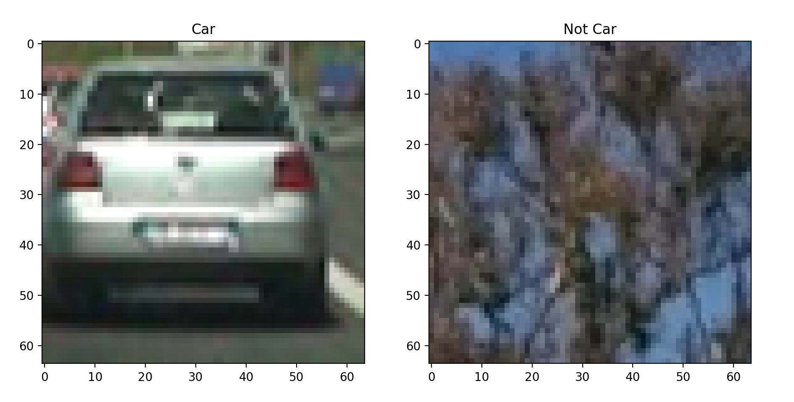
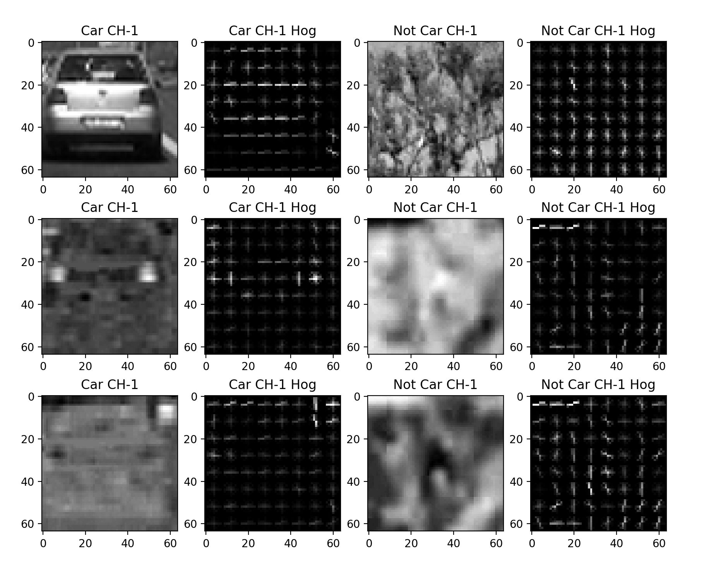
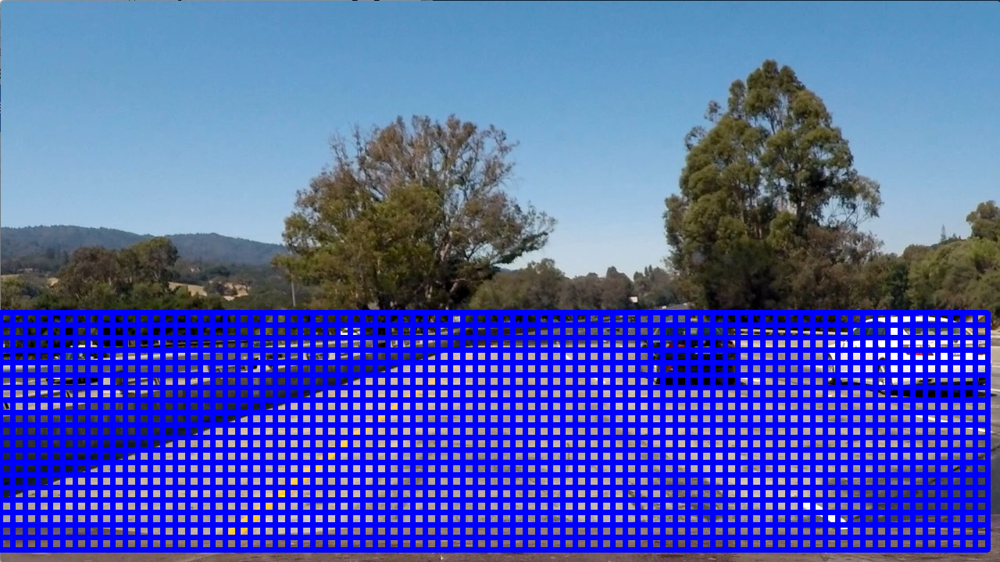
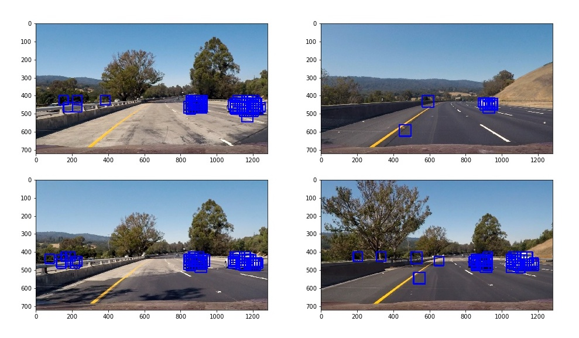
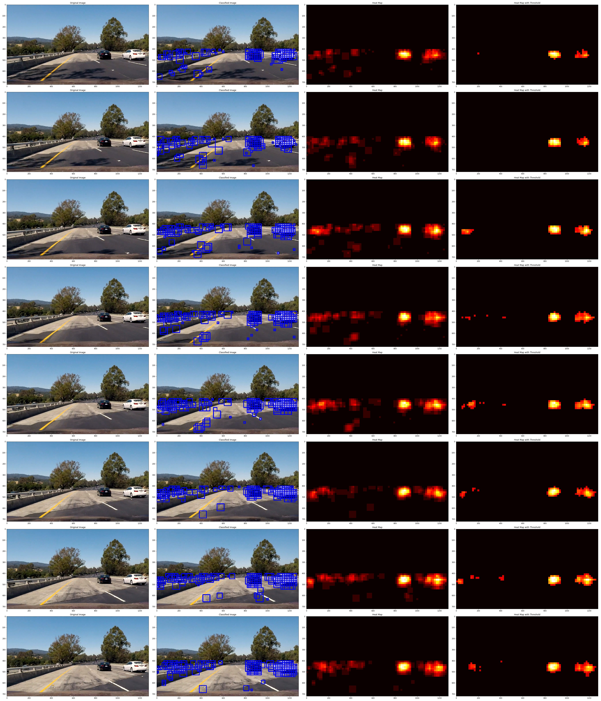
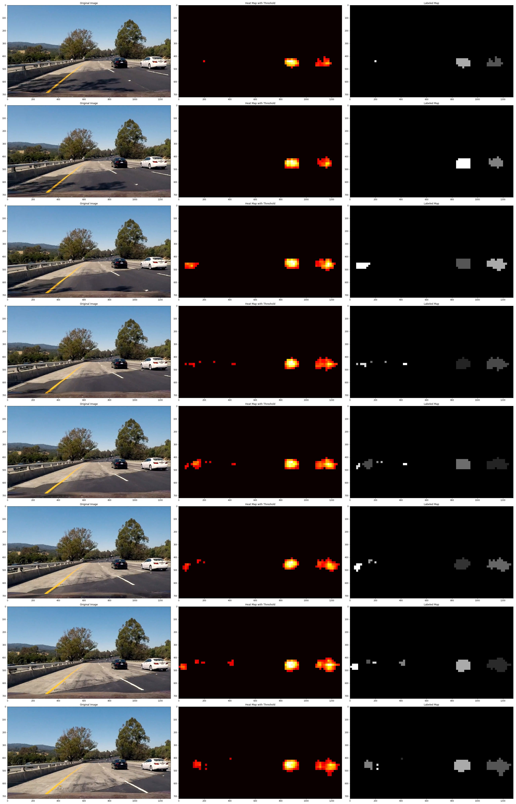
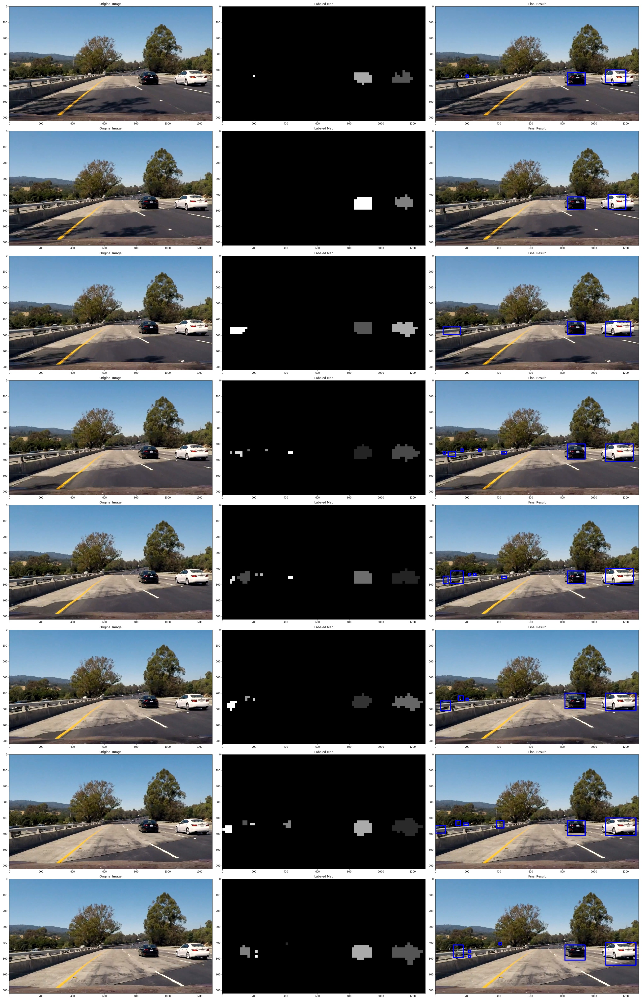

# **Vehicle Detection Project**

The goals / steps of this project are the following:

* Perform a Histogram of Oriented Gradients (HOG) feature extraction on a labeled training set of images and train a classifier Linear SVM classifier
* Optionally, you can also apply a color transform and append binned color features, as well as histograms of color, to your HOG feature vector.
* Note: for those first two steps don't forget to normalize your features and randomize a selection for training and testing.
* Implement a sliding-window technique and use your trained classifier to search for vehicles in images.
* Run your pipeline on a video stream (start with the test_video.mp4 and later implement on full project_video.mp4) and create a heat map of recurring detections frame by frame to reject outliers and follow detected vehicles.
* Estimate a bounding box for vehicles detected.

[//]: # (Image References)
[image1]: ./examples/car_not_car.png
[image2]: ./examples/HOG_example.jpg
[image3]: ./examples/sliding_windows.jpg
[image4]: ./examples/sliding_window.jpg
[image5]: ./examples/bboxes_and_heat.png
[image6]: ./examples/labels_map.png
[image7]: ./examples/output_bboxes.png
[video1]: ./project_video.mp4

---

## Histogram of Oriented Gradients (HOG)

### 1. Extracted HOG features from the training images.

My pipeline is contained in code file `search_classify_hog_subwindow.py`, and the required functions is implemented in `subwindow_function.py`.

The function used to extract HOG features is implemented in lines 16 through 33 of the file called `subwindow_function.py`.

As shown in file `search_classify_hog_subwindow.py`, I started by reading in all the `vehicle` and `non-vehicle` images (Line 27-28).  Here is an example of one of each of the `vehicle` and `non-vehicle` classes:



I then explored different color spaces and different `skimage.hog()` parameters (`orientations`, `pixels_per_cell`, and `cells_per_block`).  I grabbed random images from each of the two classes and displayed them to get a feel for what the `skimage.hog()` output looks like.

Here is an example using the `YCrCb` color space and HOG parameters of `orientations=10`, `pixels_per_cell=(8, 8)` and `cells_per_block=(2, 2)`:



### 2. Settled on final choice of HOG parameters.

I firstly select a subset from total data and split it into training set and testing set. I tried various combinations of parameters and use every condition to extract the Hog features from subset images. Then I use these features to train the model. Finally find out the combinations achieving the highest score and select the combination of parameters as final choice of HOG parameters.

Here are some results of my experments (The size of subset is 500, every condition was tested 5 times).

| parameters     | 1     | 2     | 3     | 4     | 5     | 6     | 7     | 8     | 9     | 10      |
|:--------------:|:-----:|:-----:|:-----:|:-----:|:-----:|:-----:|:-----:|:-----:|:-----:|:-------:|
| colorspace     | 'RGB' | 'RGB' | 'RGB' | 'RGB' | 'RGB' | 'RGB' | 'RGB' | 'RGB' | 'RGB' | 'YCrcb' |
| orientations   | 9     | 8     | 10    | 9     | 9     | 9     | 9     | 9     | 9     | 10      |
| pix-per-cell   | 8     | 8     | 8     | 7     | 9     | 8     | 8     | 8     | 8     | 8       |
| cell-per-block | 2     | 2     | 2     | 2     | 2     | 2     | 1     | 3     | 2     | 2       |
| channel        | 0     | 0     | 0     | 0     | 0     | 0     | 0     | 0     | ALL   | ALL     |
| test1 result   | 0.925 | 0.935 | 0.94  | 0.96  | 0.93  | 0.925 | 0.93  | 0.93  | 0.955 | 0.995   |
| test2 result   | 0.935 | 0.94  | 0.925 | 0.945 | 0.93  | 0.935 | 0.94  | 0.935 | 0.95  | 0.985   |
| test3 result   | 0.935 | 0.945 | 0.93  | 0.94  | 0.965 | 0.935 | 0.92  | 0.93  | 0.96  | 0.995   |
| test4 result   | 0.95  | 0.935 | 0.955 | 0.96  | 0.955 | 0.95  | 0.94  | 0.95  | 0.945 | 0.995   |
| test5 result   | 0.94  | 0.925 | 0.95  | 1     | 0.95  | 0.94  | 0.915 | 0.92  | 0.96  | 0.985   |

### 3. Train a classifier using selected HOG features (and color features).

I trained a linear SVM using both color features and HOG features. I defined a function `extract_features` to extract these features, which is implemented in lines 54 through 82 of the file called `subwindow_function.py`.

In lines 54 through 67 of the file called `search_classify_hog_subwindow.py` I trained a linear SVM classifier and used the `GridSearchCV` to modify its `C` parameter. Then save the final model as file `vehicleClf.pkl`.

## Sliding Window Search

### Implement sliding window search.

I implemented a sliding window search in a function named `find_car`, which is located in line 81-139 in file `subwindow_function.py`.

```
def find_cars(img, ystart, ystop, scale, svc, X_scaler, orient, pix_per_cell,
              cell_per_block, spatial_size, hist_bins, windows)
```

In this function, I firstly use `scale` to resize the image, which is used to modify the size of sliding window in original image. Then I use parameter `windows` to define the shape of window. I use `cells_per_step` to control the overlap windows. For example, if I set `cells_per_step = 2` and `windows = (64, 56)`, it means that it will overlap 75% windows in horizontal direction and 71.43% in vertical direction.

I tried various combinations of `scale` and `cells_per_step` to find cars with the SVM classifier in frames of `test_video.mp4`, and then find the combination that had best performance. Here is a example of my slide windows with `scale = 1`, `cells_per_step = 2` and `windows = (64, 32)`.



Ultimately I searched on two scales using YCrCb 3-channel HOG features plus spatially binned color and histograms of color in the feature vector, which provided a nice result.  Here are some example images:


---

## Video Implementation

Here's a [link to my video result](./project_output.mp4)

I also try to combine the lane line detection with vehicle detection. Here's a [link to the result](./vehicle_with_lane_line.mp4)

### 1. Implement some kind of filter for false positives and some method for combining overlapping bounding boxes.

I recorded the positions of positive detections in each frame of the video.  From the positive detections I created a heatmap and then thresholded that map to identify vehicle positions.  I then used `scipy.ndimage.measurements.label()` to identify individual blobs in the heatmap.  I then assumed each blob corresponded to a vehicle.  I constructed bounding boxes to cover the area of each blob detected.

Here's an example result showing the heatmap from a series of frames of video, the result of `scipy.ndimage.measurements.label()` and the bounding boxes then overlaid on the last frame of video:

#### Here are six frames and their corresponding heatmaps:



#### Here is the output of `scipy.ndimage.measurements.label()` on the integrated heatmap from all six frames:


#### Here the resulting bounding boxes are drawn onto the last frame in the series:


---

## Discussion

### Some problems / issues I faced in your implementation of this project.

Here I'll talk about the approach I took, what techniques I used, what worked and why, where the pipeline might fail and how I might improve it if I were going to pursue this project further.

In this project, the largest problem I faced might be the performance of classifier. This classifier is not so robust to identify vehicles and other things. For example, the classifier will sometimes identify a shrub, a fense or a tree's shadow as a car.

There is another problem I faced in this project. The threshold to remove false positives is difficult to tune. If the threshold is too low, there will many false positives in results, but if the threshold is too high, a car may not be detected. Although I have tuned the threshold which help the pipeline perform well in `test_video.mp4`, the pipeline might failed in `project_video.mp4`.

In the future, I will try to augment the dataset and combine some more powerful CNN classifier like InceptionV4, VGG and ResNet50. I also find a framework named [SSD (Single Shot MultiBox Detector)](https://github.com/weiliu89/caffe/tree/ssd) for object detection. I want to use the SSD to replace the slide windows for vehicle detection.


